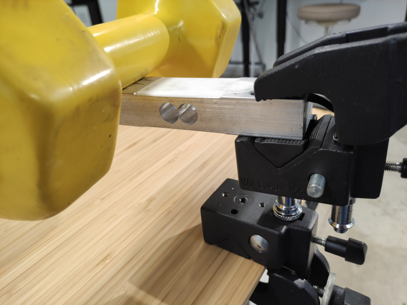

# HX711 and 200KG Load Sensor

# Connection

| 200KG Load Sensor bar | Sensor Module | ESP32    |
| -------               | ----          | ------   |
| `E+`                  | White         |          |
| `E-`                  | Black         |          |
| `A-`                  | Red           |          |
| `A+`                  | Green         |          |
|                       | `VCC`         | `3.3V`   |
|                       | `DT`          | `GPIO23` |
|                       | `SCK`         | `GPIO19` |


## References and resources

- Purchased from: [Aliexpress](https://www.aliexpress.com/item/32861486196.html?spm=a2g0s.9042311.0.0.47be4c4dC2TPcN)
- Load sensor connection to HX711: `Black E-, Green S+, Red S-, White E+ [E: Power, S: signal]`
- Schematic reference: [circuito](https://www.circuito.io/app?components=513,13879,360217)
- [Calibration reference.](https://circuits4you.com/2016/11/25/hx711-arduino-load-cell)


# MQTT messages

Weight will be broadcasted every second through MQTT to `scale/[MAC] `

```json
{"weight": -0.013, "tpe": "weight"}
```

## Tare: Reset to zero

```bash
mosquitto_pub  -h 10.0.2.78 -t s2d/scale/FCF5C43119AC/tare -m ''
```

## Set calibration factor

```bash
mosquitto_pub  -h 10.0.2.78 -t s2d/scale/FCF5C43119AC/calfactor -m '{"val":19650.0,"persist":false}'
```

To calibrate:

1. Remove any weight from the load sensor bar.
2. Send tare.
3. Put an object with known weight on the load sensor. (Object to be placed on the other side of the sensor bar, see picture below)
4. Change calibration factor until the returned weight is the same as the known weight.


